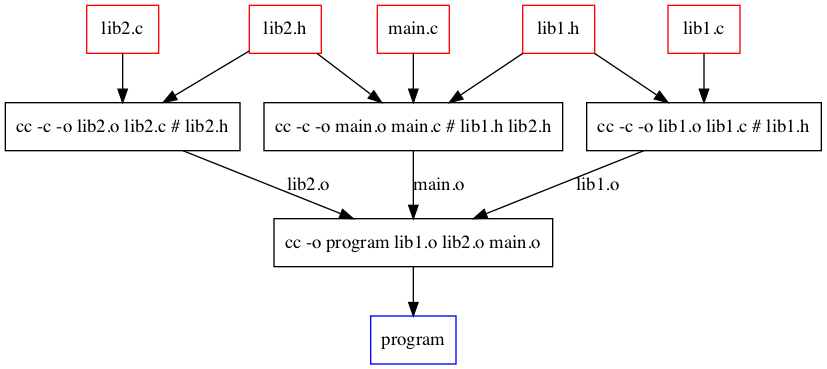
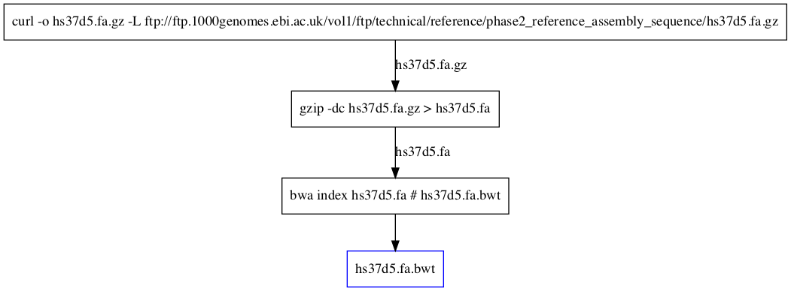

# Examples

## Build C program

```bash
cc -o [[lib1.o]] ((lib1.c)) # ((lib1.h))
cc -o [[lib2.o]] ((lib2.c)) # ((lib2.h))
cc -o [[main.o]] ((main.c)) # ((lib1.h)) ((lib2.h))
cc -o [[program]] ((lib1.o)) ((lib2.o)) ((main.o))
```



## Prepare hs37d5 index file

```bash
curl -o [[hs37d5.fa.gz]] -L ftp://ftp.1000genomes.ebi.ac.uk/vol1/ftp/technical/reference/phase2_reference_assembly_sequence/hs37d5.fa.gz
gzip -dc ((hs37d5.fa.gz)) > [[hs37d5.fa]]
bwa index ((hs37d5.fa)) # [[hs37d5.fa.bwt]]
```



## Analyze simulated FASTQ with GATK

```bash
#% GATK_VERSION = "4.0.10.1"
#% BWA_VERSION = "0.7.17"
#% SAMTOOLS_VERSION = "1.9"

# Generate simulation FASTQ
python3 ((create-mutated-fasta.py)) ((e-coli-NC_011750.1.fasta)) --output [[e-coli-NC_011750.1-mutated-base.fasta]] --seed 123
for i in 1 2; do
    python3 ((create-mutated-fasta.py)) ((e-coli-NC_011750.1-mutated-base.fasta)) --output [[e-coli-NC_011750.1-mutated{{i}}.fasta]] --seed 123{{i}}
    art_bin_MountRainier/art_illumina -ss HS25 -i ((e-coli-NC_011750.1-mutated{{i}}.fasta)) -p -l 150 -f 20 -m 200 -s 10 -o generated{{i}} # [[generated{{i}}1.fq]] [[generated{{i}}2.fq]]
    for j in 1 2; do
        sed -e 's/@/@{{i}}-/g' ((generated{{i}}{{j}}.fq))|gzip -c > [[generated{{i}}{{j}}-fix.fq.gz]]
    done
done

# Mapping
for i in 1 2; do
    bwa-{{BWA_VERSION}}/bwa mem -R "@RG\tID:ECOLI-SIM\tSM:ECOLI_SIM\tPL:illumina\tLB:ECOLI_SIM" e-coli-NC_011750.1.fasta ((generated{{i}}1-fix.fq.gz)) ((generated{{i}}2-fix.fq.gz))|samtools-{{SAMTOOLS_VERSION}}/samtools sort -o [[generated{{i}}.bam]] - # ((e-coli-NC_011750.1.fasta.bwt))
    gatk-{{GATK_VERSION}}/gatk --java-options "-Xmx4G" MarkDuplicates -I ((generated{{i}}.bam)) -O [[generated{{i}}-markdup.bam]] -M [[generated{{i}}-markdup-metrics.txt]]
    gatk-{{GATK_VERSION}}/gatk --java-options "-Xmx4G" BaseRecalibrator -I ((generated{{i}}-markdup.bam)) -O [[generated{{i}}-bqsr.txt]] -R ((e-coli-NC_011750.1.fasta)) --known-sites ((empty.vcf.gz)) # ((e-coli-NC_011750.1.dict))
done

gatk-{{GATK_VERSION}}/gatk --java-options "-Xmx4G" GatherBQSRReports -I ((generated1-bqsr.txt)) -I ((generated2-bqsr.txt)) -O [[generated-bqsr-merged.txt]]

# Apply BQSR
for i in 1 2; do
    gatk-{{GATK_VERSION}}/gatk --java-options "-Xmx4G" ApplyBQSR -R ((e-coli-NC_011750.1.fasta)) -I ((generated{{i}}-markdup.bam)) -O [[generated{{i}}-recal.bam]] --bqsr-recal-file ((generated-bqsr-merged.txt)) # ((e-coli-NC_011750.1.dict))
done

# Merge

samtools-{{SAMTOOLS_VERSION}}/samtools merge -f [[generated-merged.bam]] ((generated1-recal.bam)) ((generated2-recal.bam))
samtools-{{SAMTOOLS_VERSION}}/samtools index ((generated-merged.bam)) # [[generated-merged.bam.bai]]

# Variant call
gatk-{{GATK_VERSION}}/gatk --java-options "-Xmx4g" HaplotypeCaller -R ((e-coli-NC_011750.1.fasta)) -I ((generated-merged.bam)) -O [[generated-call.vcf.gz]] -ERC GVCF -bamout [[generated-merged-realigned.bam]] # ((e-coli-NC_011750.1.dict)) ((generated-merged.bam.bai))
gatk-{{GATK_VERSION}}/gatk --java-options "-Xmx4g" GenotypeGVCFs -R ((e-coli-NC_011750.1.fasta)) -V ((generated-call.vcf.gz)) -O [[generated-call-result.vcf.gz]] # ((e-coli-NC_011750.1.dict))
```

